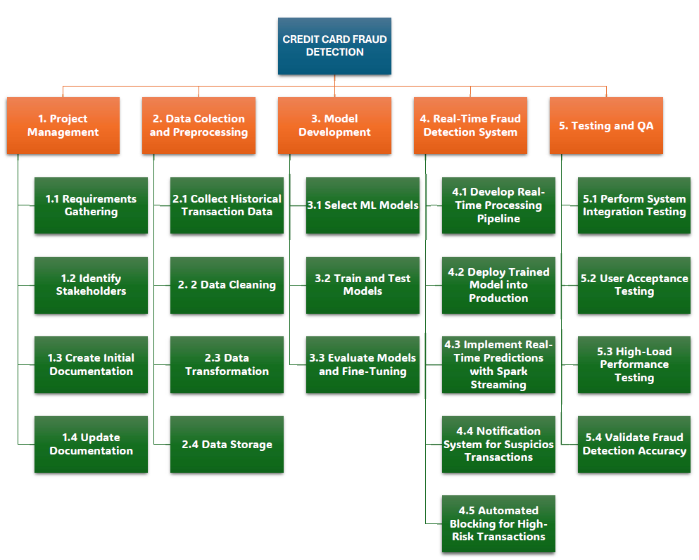
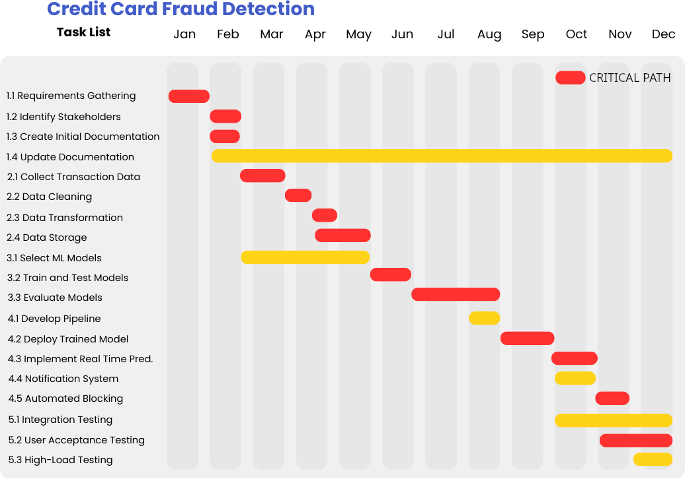

# Project Charter

---

## 1. Charter Introduction

### 1.1 Document Change Control
*Describe how changes to this Project Charter will be requested, reviewed, approved, and documented.  
Include version history, approval authority, and change tracking procedures.*

| Version | Date | Description of Change | Author | Approved By |
|-------|------|-----------------------|--------|-------------|
| 1.0   |  02/07/2026    | Initial version       |    Marcel Jar    |   Vida Movahedi          |

### 1.2 Executive Summary
*Provide a high-level overview of the project, including its purpose, scope, key objectives, and expected value to the organization. This section should be understandable to executive stakeholders.*

This project aims to design, develop, and deploy a machine learning–based credit card fraud detection system by December 30, 2026, in alignment with the bank’s strategic objective of protecting customers, safeguarding revenue, and strengthening trust in its digital payment services. The system will process transaction data in near real time and is expected to achieve at least a 20% improvement in fraud detection accuracy and a 15% reduction in false positives compared to the current rule-based system.

By leveraging scalable data processing and advanced analytics, the solution will enable the bank to proactively identify and respond to fraudulent activity, reducing fraud-related financial losses by a target of 10% within the first six months of deployment. The project is achievable using existing data infrastructure and cross-functional collaboration between data science, IT, and risk management teams.

This initiative is directly relevant to the bank’s priorities of risk mitigation, regulatory compliance, and data-driven decision-making. Successful implementation will enhance customer experience by minimizing unnecessary transaction declines, improve operational efficiency, and reinforce the bank’s reputation as a secure and trusted financial services provider. The project will be considered successful upon deployment by the December deadline and validation that the defined performance metrics have been met.

### 1.3 Authorization
*Formally authorize the project. Identify the sponsor and confirm approval to allocate resources and proceed.*

**Project Sponsor:**  Marcel Jar

**Approval Date:**   04/07/2026

---

## 2. Project Overview

### 2.1 Project Summary
*Briefly describe what the project is, why it is being undertaken, and the problem or opportunity it addresses.*

Credit card fraud poses a significant business risk to financial institutions by causing direct financial losses, increasing operational and compliance costs, and damaging customer trust and brand reputation, creating a clear need for more effective and scalable fraud detection solutions. This project proposes the development of a machine learning–based credit card fraud detection system that leverages historical transaction data to identify potentially fraudulent activity in near real time, improving detection accuracy beyond traditional rule-based approaches. The project will involve collecting and preprocessing large-scale transaction datasets, addressing data quality issues and class imbalance, and training supervised learning models such as logistic regression and decision trees, complemented by anomaly detection techniques to capture emerging fraud patterns. The selected and optimized model will be integrated into a real-time transaction evaluation pipeline using industry-standard technologies, including Python-based machine learning libraries and Apache Spark for scalable data processing. Key beneficiaries of this project include fraud prevention and risk management teams, operational and customer service units, executive leadership, and customers, who will benefit from enhanced transaction security, reduced fraud-related losses, and improved confidence in the institution’s financial services, with approval of the Project Charter authorizing the resources required to deliver these outcomes.

### 2.3 Project Scope

#### Work Breakdown Structure

### 2.4 Milestones
*List major project milestones and their target completion dates.*

**Project Milestones**

1. **Project Charter Approved**  
   Stakeholders formally approve the project charter, authorizing the project to proceed.

2. **Requirements and Scope Baseline Established**  
   Project requirements, scope boundaries, and success criteria are reviewed and approved by stakeholders.

3. **Dataset Acquisition Approved**  
   Required historical credit card transaction dataset is obtained and validated for use in the project.

4. **Data Preparation Phase Completed**  
   Data cleaning, preprocessing, and feature engineering steps are finalized and ready for model development.

5. **Initial Model Training Completed**  
   Baseline machine learning models are successfully trained and evaluated.

6. **Model Selection Decision Approved**  
   Stakeholders review model evaluation results and approve the selected model for system integration.

7. **Fraud Detection System Prototype Ready for Testing**  
   The selected model is integrated into a working prototype capable of evaluating transaction data.

8. **User Acceptance Testing Completed**  
   Stakeholders validate the system prototype and confirm that it meets the project requirements.

9. **Project Closure Approved**  
   Final documentation is accepted and the project is formally closed.

### 2.5 Deliverables
*Identify the tangible outputs the project will produce.*

**Project Deliverables**

1. **Project Charter Document**  
   A formally approved charter defining the project objectives, scope, stakeholders, constraints, risks, milestones, and success criteria.

2. **Validated Credit Card Transaction Dataset**  
   A curated dataset containing historical credit card transactions, including both legitimate and fraudulent cases, accompanied by a data description report.

3. **Data Preparation Pipeline**  
   A documented Spark-based pipeline that performs data cleaning, normalization, feature engineering, and class imbalance handling.

4. **Baseline Machine Learning Model Package**  
   Implemented and trained baseline models (e.g., logistic regression and decision trees) including training scripts and performance metrics.

5. **Model Evaluation Report**  
   A formal report comparing candidate models using evaluation metrics such as precision, recall, F1-score, and ROC-AUC.

6. **Final Fraud Detection Model**  
   A trained and optimized machine learning model selected for deployment based on agreed evaluation criteria.

7. **Fraud Detection System Prototype**  
   A working prototype capable of analyzing incoming transaction data and identifying potentially fraudulent transactions.

8. **System Architecture and Technical Documentation**  
   Documentation describing the system architecture, data pipeline, model deployment process, and maintenance guidelines.

9. **Final Project Report**  
   A comprehensive report summarizing the project methodology, results, system performance, and recommendations for future improvements.

### 2.6 Project Cost Estimate

### 2.6.1 Personnel Cost

| **Role**            | **Daily Rate** | **Allocation (%)** | **Sprint Burn Rate** |
|---------------------|----------------|---------------------|---------------|
| Scrum Master        | $300           | 50%                | $1,500.00        |
| Data Analyst 1      | $100           | 100%               | $1,000.00        |
| Data Analyst 2      | $100           | 100%               | $1,000.00        |
| QA Specialist       | $150           | 50%                | $750.00          |
| **Total**           |                |                    | **$4,250.00**    |

#### Total Personnel Cost

| **Description**           | **Value** |
|---------------------------|-----------|
| Sprint Burn Rate     | $4,250.00    |
| Number of Sprints         | 6         |
| **Total**  | **$25,500.00** |

### 2.6.2 Fixed Cost

| **Item**                  | **Qty** | **Cost/Item** | **Total Cost** |
|---------------------------|---------|---------------|----------------|
| Computer Hardware         | 2  (units)     | $750.00          | $1,500.00           |
| Databricks                | 3 (months)       | $80.00           | $240.00            |
| **Total**     |                |               | **$1,740.00**       |

### 2.6.3 Contingency

| **Description**       | **Percentage** | **Personnel _ Fixed costs** | **Total Contingency** |
|-----------------------|----------------|------------------------|-------------------------|
| Contingency Funds      | 15%            | $27,240.00               | **$4,086.00**                 |

### 2.6.4 Total Estimated Cost

| **Cost Category**              | **Amount**   |
|--------------------------------|--------------|
| Total Personnel Cost          | $25,500.00      |
| Total Fixed Cost              | $1,740.00        |
| Total Contingency (15%)        | $4,086.00      |
| **Total Estimated Cost**      | **$31,326.00**  |

### 2.7 Gantt Chart

### 2.8 Project Risks, Assumptions, and Constraints

#### 2.8.1 Risks
*Identify potential risks and their possible impact.*

*to be done later*

#### 2.8.2 Assumptions
*List assumptions that are being made for planning purposes.*

*to be done later*

#### 2.8.3 Constraints
*Identify limitations that restrict the project (e.g., budget, schedule, resources).*

*to be done later*

---

## 3. Project Organization

### 3.1 Project Team Structure
*Outline the project team and reporting relationships.*

*to be done later*

| Role | Responsibility |
|-----|----------------|
|     |                |

### 3.2 Key Stakeholders
*Outlines any parts that have an interest in the proejct.*

*to be done later*

---

## 4. Project References
*List documents, standards, policies, or external references relevant to this project.*

*optional*

---

## 5. Glossary and Acronyms
*Define key terms and acronyms used in this document.*

*optional*

| Term / Acronym | Definition |
|---------------|------------|
|               |            |
